# Exploring 3D Animation with 3ds max 7
### *by Steven Till*
---

<table style="border: 0; border-collapse: collapse;">
  <tr>
    <td width="40%"> 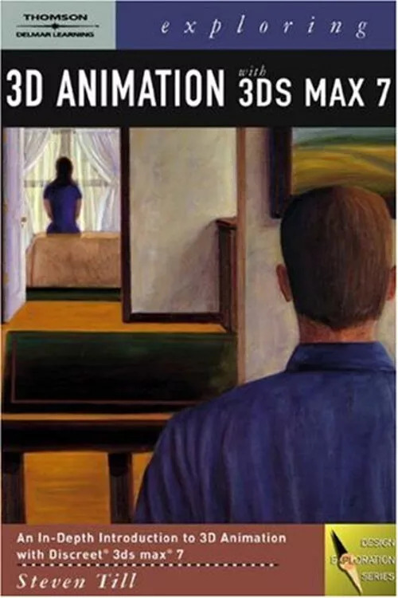 </td>
    <td width="60%" style="vertical-align:top;"> This chapter is an excerpt from my textbook on 3d animation using Discreet's 3ds max software.   <i>This sample was created in markdown for distribution flexibility.</i> </td>
  </tr>
</table>

---

## Particle Systems & Dynamics
A rain storm, spray of water from a hose, smoke billowing from a burning vehicle, and a large flock of birds have one thing in common: wehn created in a 3D environment they can be comprised of a massive number of objects. Trying to animate and control a large amount of objects can be unwieldy and inproductive, especially if they all have similar movement and properties. To the rescue are particle systems. Particle systems are a selection of tools that create and define the emission of a potentially large number of particles from a single source. The particle can be rendered in a variety of 2D and 3D shapes and can even appear as copies of geometry already located, even hidden, in your scene.

Space warps are forces *(such as gravity or a vortex)* that can alter a particle's direction and speed based on the parameters set for the space warp. Deflectors are planes, spheres, or even scene objects that, suprisingly, deflect any particles that impact them. Particles can bounce, stop, or even spawn new particles when they collide with a deflector. Using particle systems in conjunction with space warps and deflectors, you can make your storm of hail stones, gold coins, or spacecraft debris rainii down upon the earth, bouncing off buildings and cars and coming to a rest on the ground.

### Chapter Objectives

+ Understanding particle systems
+ Create a Super Spray particle system
+ Define particle speed and quantity
+ Specify a particle type to render
+ Adjust particle spawning to create additional particles
+ Load and save particle presets
+ Alter particle directions with space warps
+ Bounce particles with deflectors

---

#### Understanding Particle Systems

Particle systems come in two different types: event-driven and non-event-driven. Event-driven particle systems use a system of tests and operators, partitioned in groups called events, to determine the actions of the particles. Operators are features (such as shape, size, and material) that define the particle. They are place in sequential order according to how they are to be applied to particles. Tests are conditions that must be met before a particle can continue to the next event.

Tests can look at a particle's age (how long the particle exists), its size, whether it has impacted a deflector, or many other occurrences within the scene. 3ds max has a robust event-driven particle system called Particle Flow *(see Figure-01)*, which uses a flow chart analogy for laying out the events, operators, and tests in a 3ds max scene. In the Particle View window, operators and tests (which link one event to the next)are dragged from a depot into events. Unfortunately, Particle Flow is extensive and beyond the scope of this book. See the section "Adventures in Design &mdash; Particle Flow" for an example of Particle Flow in action.

<figure style="text-align: left;">
    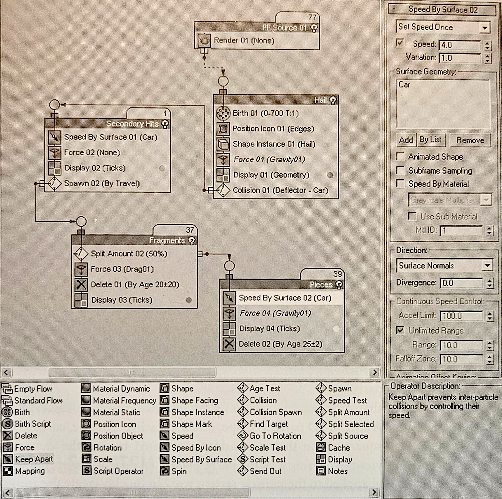
    <figcaption><i><b>Figure-01:</b> The Particle View window is used to lay out the events, operators, and tests of ta Particle Flow particle system.</i></figcaption>
</figure>

Non-event-driven particle systems use a series of value-based parameters to determine the appearance of the particles as well as their size, speed, and other characteristics. All of the non-event-driven particle systems in 3ds max have two common features: an emitter and the particles themselves. The emitter *(see Figure-02)* is a non-rendering object used as the location where the particles begin their lives. Depending on the particle system selected, the emitter can be one of a variety of shapes, including planes, boxes, cylinders, and emitter-specific icons. When using the PArray or PCloud particle systems, the system emitter can act only as an icon in the viewport, whereas selected geometry in the scene can actually emit the particles.

<figure style="text-align: left;">
    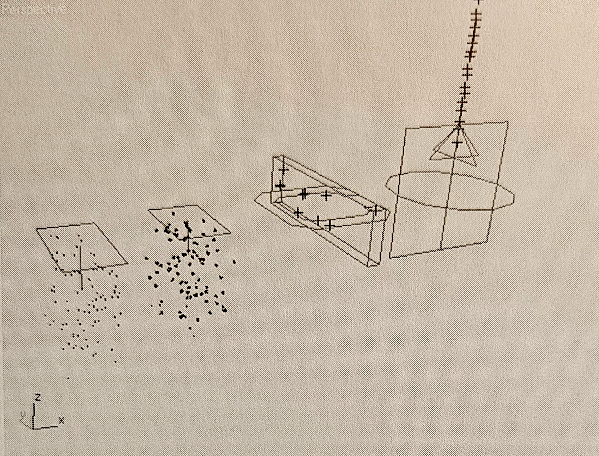
    <figcaption><i><b>Figure-02:</b> From left to right, the emitters for a Spray, Snow, ParticleCloud, and Super Spray particle system.</i></figcaption>
</figure>

The real meat of a particle system is the particles. You create particle systems to generate a large number of objects that follow roughly the same course, and you have a great deal of control over what those particles do and how they appear. The most important aspect of the particles is how they look, also known as the type of particle emitted. Depending on the particle systems selected, the particles can be 2D or 3D and can appear in a variety of standard shapes, including triangles, stars, tetrahedrons, cubes, and spheres. A special 2D particle shape, called a "facing" particle, consists of a square shape that is constantly oriented toward the camera or viewport. Using a facing particle, with an opacity-mapped material applied to the particle system you can quickly create the appearance of smoke, dust, or snowflakes without the need for a massive amount of particles. For the purpose of viewport speed, the quantity and type of particles shown in the viewports can be different from those shown in the rendered frames.

Two of the more powerful and entertaining particle-type options available are MetaParticle and Instanced Geometry. Metaparticles, based on metaball technology, are spherical particles each of which has an area of influence around it. Whenever two areas of influence intersect, the metaparticles change their shapes so that they pull toward each other and appear to meld together. This gives the appearance of blobs of fluid intermixing in the particle stream. When paired with a shiny or reflective material, the metaparticles can add an amazing look to your scene.

> **NOTE:** Metaparticles are computationally intensive and can, especially when used with ray-traced materials, add significant time to your renderings.

When you select Instanced Geometry as the particle type, any 3D object in your scene (even hidden geometry) can be substituted for each particle at rendering time. This gives you the ability to shoot bullets out of one end of a weapon with one particle system and eject shell casings out of the side with another. When a group is selected as the instanced object, 3ds max will randomly select a group member for each particle emitted. *Figure-03* shows examples of some of the particle types available to the Super Spray particle system.

<figure style="text-align: left;">
    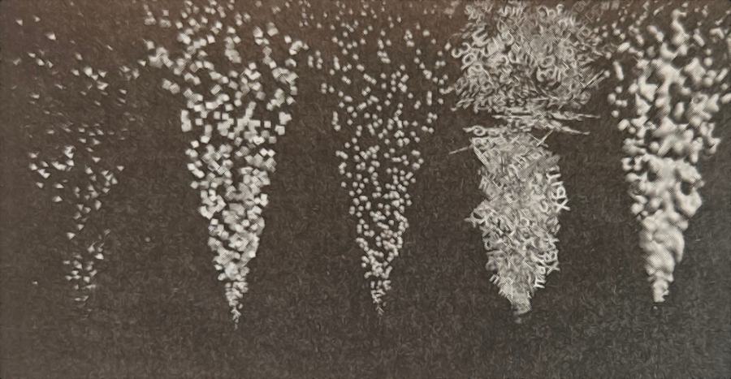
    <figcaption><i><b>Figure-03:</b> From left to right, the particle types selected are Triangle, Cube, Sphere, Instanced Geopmetry, and MetaParticle.</i></figcaption>
</figure>

#### Particle System Types

3ds max comes packed with a variety of particle systems, several of which can be classified as "legacy" because their functionality has been included in some of the more capable systems. The two oldest, and the first to be included with 3ds max, are Spray and Snow. Although these still function as they have for several years, their capabilities have been eclipsed with the Super Spray and Blizzard particle systems, both of which were formerly third-party programs jpurchased separately from max. The greatest drawbacks of the legacy particle systems are their limited particle selections and particle control. The non-event-driven particle systems included with 3ds max are as follows:

+ ___SPRAY:___ A very basic particle system. The particles are emitted from a plane-shaped emitter with a choice of rendering either tetrahedron or facing particles.   

+ ___SNOW:___ Similar to the Spray particle system, Snow has additional controls for adding a tumble factor to each 2D particle emitted. This can give the star, triangle, or facing particles the rotational randomness found in falling snow or blowing leaves.   

+ ___SUPER SPRAY:___ Has a large amount of control over the emission, motion, and type of particles and whether particles can spawn additonal particles upon collisions. Many features have Variation parameters that add randomness to the particles' motion or appearance. Particle parameters can be saved as presets and loaded into other 3ds max scenes.   

+ ___BLIZZARD:___ An updated version of the Snow particle system with much of the control found in the Super Spray particle system.   

+ ___PARRAY:___ Uses an existing geometry object in the scene as the emitter. Particles can be emitted from the object's edges, vertices, or faces.   

+ ___PCLOUD:___ Restricts the location of the particles to the volume of the PCloud icon or a selected geometry object.   

---

#### Create A Super Spray Particle System

When creating a linear spray of particles, with non-event-driven particle systems the Super Spray system is generally the most common particle system used. Its control over the spread, speed, timing, particle type, and particle motion meet the needs of most situations. In the following exercises, you will create a Super Spray particle system that emits particles from the back of a deep-welled object and around another object.

##### Create the emitter.

To create an emitter, perform the following steps.

1. From the companion CD-ROM, open the file *SuperSpray.max*.

2. In the Command panel, select __Create > Geometry > Particle Systems__ from the drop-down list and then click on the Super Spray button *(see Figure-04)*.

<figure style="text-align: left;">
    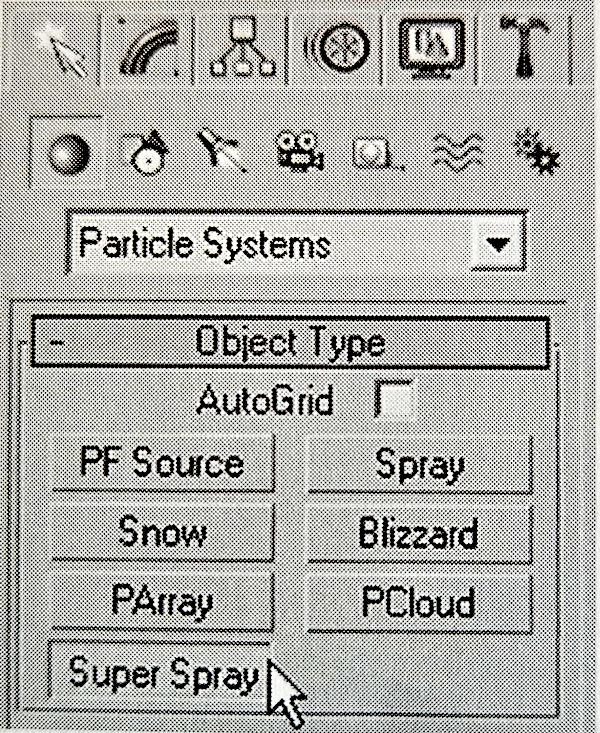
    <figcaption><i><b>Figure-04:</b> Select Super Spray from the Command panel.</i></figcaption>
</figure>

3. In the Left viewport, click and drag to create the Super Spray emitter *(see Figure-05)*. The initial direction of the particles is always in the positive Z direction of the viewport in which they are created.

<figure style="text-align: left;">
    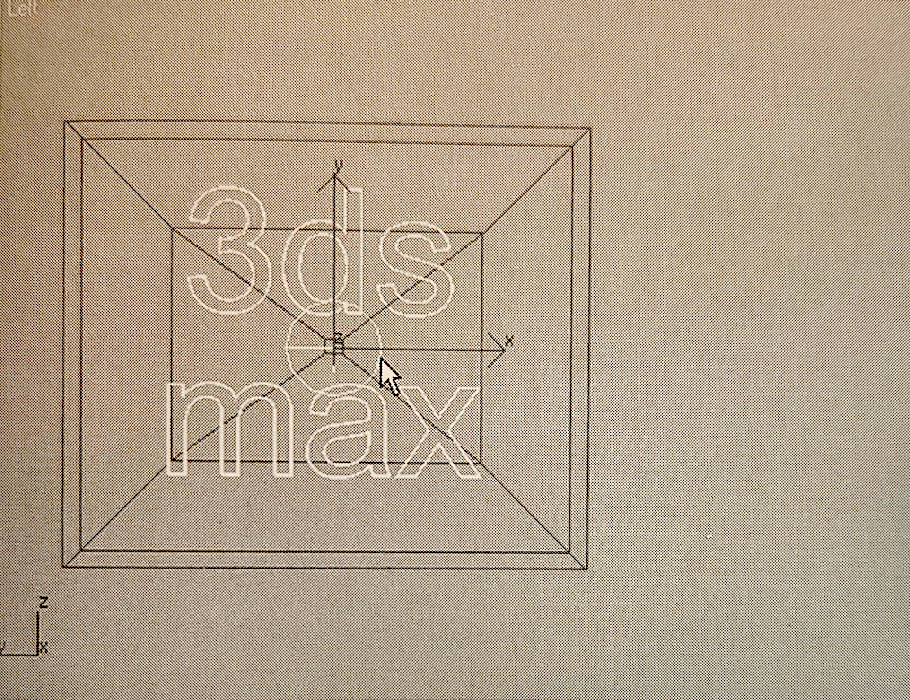
    <figcaption><i><b>Figure-05:</b> Create the Super Spray particle system in the Left viewport.</i></figcaption>
</figure>

4. Move the emitter to the back of the box-shaped object.

5. Drag the Time slider and watch the particles as they exit the emitter, flow in a straight line, and then disappear.

#### Define the particle speed and quantity.

As you see when you drag the Time Slider, the particles leave the emitter from a single point, travel in a straight line, and then vanish before they approach the end of the box. There is a limited nimber of particles in a scene, and each particle has a predetermined life span measured in frames. Once a particle has exhausted its allotment of frames, it dies and is recycled in the particle system and reemitted. Two parameters define the distance a particle travels before it dies: Life and Speed. To increase the distance a particle travels, either increase the Life setting *(the object travels at the same velocity for a longer amount of time)* or the Speed setting *(the object travels for the same amount of time but at a greater velocity)*, or both.

You should also notice that the emitter discontinues discharging particles soon after it starts. The Super Spray particle system only emits particles over the range of time defined by the Emit Start and Emit Stop parameters in the Particle Generation rollout *(see Figure-06)*. Particles begin emitting at the Emit Start frame and end at the Emit Stop frame, allowing you to bracket the particles during a specific time frame. The Dispay Until parameter determines which frame 3ds max will stop displaying and rendering particles regardless of the Emit Stop setting. For example, if Emit Stop is set to 300 but Display Until is set to 200 no particle will be visible after frame 200.

<figure style="text-align: left;">
    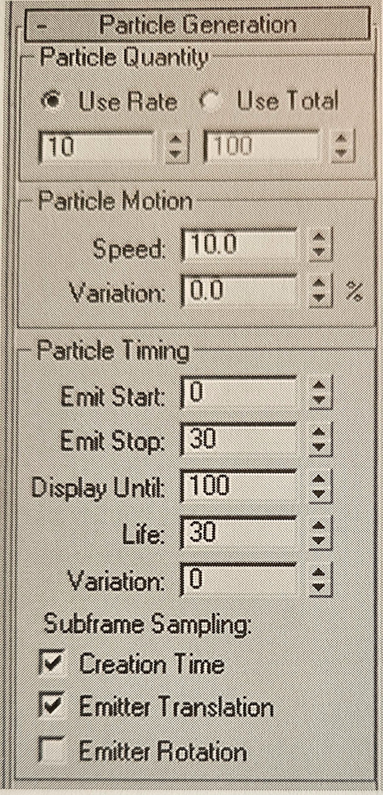
    <figcaption><i><b>Figure-06:</b> Particle quantity and speed are set in the Particle Generation rollout.</i></figcaption>
</figure>

Finally, the density of particles in the rendered scene and in the viewports must be addressed. The Particle Quantity section has two options: Use Rate and Use Total, each with a spinner for entering a quantity value. Use Rate determines the number of particles emitted during each frame, whereas Use Total sets the number of particles emitted over the life of the system. Use Rate is more commonly used and is the preferred option for creating a constant stream of particles.

Viewport performance can take a significant hit when trying to display a large number of objects, especially when the objects are animated. To keep your performance from degrading while particle systems are visible, you only display in the viewports a fraction of the number of particles emitted and rendered. The Percentage of Particles setting in the Basic Parameters rollout determines the percentage of particles, as defined by the Use Rate or Use Total setting, displayed in the viewports. All particles emitted are shown when the scene is rendered.

##### Set the Life and Speed.

To establish the Life and Speed parameters of the particle system, perform the following steps.

1. Continue with the previous excercise oropen the file *SuperSpraySpeed.max* from the companion CD-ROM.

2. Drag the Time Slider to frame 100.

3. Select the particle system and then increase the Emit Stop and Display Until values to *200*. This will force the particle system to emit and display particles for the current length of the animation in the scene *(see Figure-07)*. The particles still only travel half the distance to the opening of the box.

<figure style="text-align: left;">
    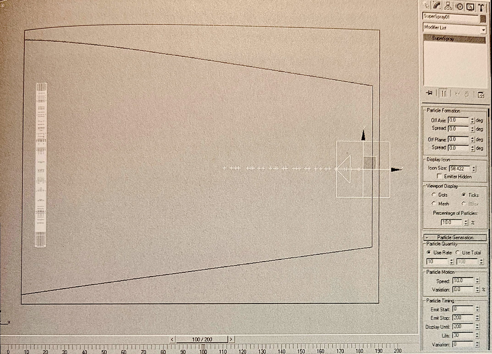
    <figcaption><i><b>Figure-07:</b> Setting the Emit Stop and Display Until parameters extends the amount of time particles will be emitted and displayed.</i></figcaption>
</figure>

4. Increase the Speed to *15* to boost the velocity by 50%.

5. Increase the Life value until the particles pass beyond the text object at the mouth of the box.

6. Click on the Play Animation button at the bottom of the user interface to ensure that a constant flow of particles emits toward the mouth of the box.

##### Set the Quantity and Spread

Setting the number of particles to emit determines the density of the particles in the system. A Use Rate of 10 may be fine at the beginning of a project, but as the Speed or Life is increased, the Use Rate may also need to be increased to maintain the particle density. To establish quantity and spread, perform the following steps.

1. In the Particle Generation rollout, set the Use Rate to *15*.

2. Set the Percentage of Particles to *100* temporarily, to see the actual number of particles to be emitted.

3. Increase the two Spread values in the Particle Formation section of the Basic Parameters rollout until the particles are emitted in a pattern slightly wider than the inside of the box, similar to the particle system shown in *Figure-08*. Off Axis Spread fans the particles out horizontally and Off Plane Spread fans the particles vertically.

<figure style="text-align: left;">
    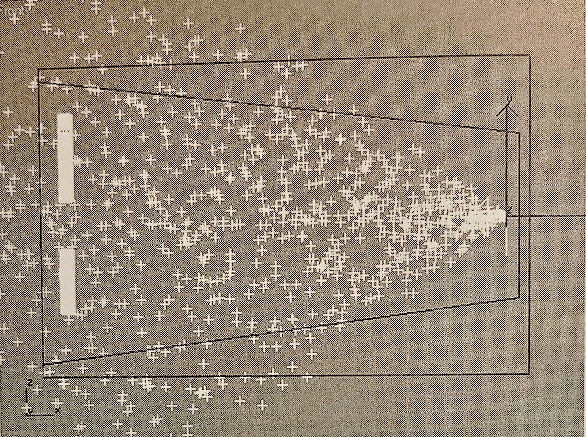
    <figcaption><i><b>Figure-08:</b> With Percentaage of Particles set to 100, the totaly number of particles is shown in the viewports.</i></figcaption>
</figure>

4. Set the Percentage of Particles back to *10*.

#### Select a Particle Type

When selecting a particle type, there are two areas to consider: how the particles are to appear in the viewports and how they are to appear in the rendered frames. There are four viewport particle display options, found in the Viewport Display section *(see Figure-09)* of the Basic Parameters rollout, that balance display information with display speed. Dots and Ticks represent the particles in the scene as dots or crosses in the viewports. Both fo these options efficiently display the particles with a minimum of resources required. However, the Ticks option generally presents the particles in a manner that is a bit easier to follow in the viewports.

<figure style="text-align: left;">
    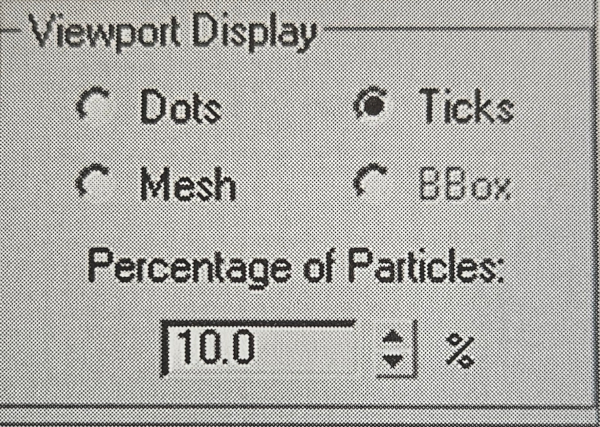
    <figcaption><i><b>Figure-09:</b> Set the particle viewport display option in the Viewport Display section.</i></figcaption>
</figure>

The Mesh and BBox options display the particles as 3D mesh objects. The Mesh option shows all polygons of the objects at the selected rendering level of each viewport *(see Figure-10)*, and the BBox option shows each particle *(see Figure-11)* as a bounding box *(i.e. the smallest possible box the object could completely fit within)*. Mesh can provide an accdurate picture of where and how the particles are dispersed in the scene and how they interact with the other geometry. This is even more helpful when Instanced Geometry *(discussed in material to follow)* is selected as the particle type. Althought BBox is not nearly the offender that Mesh is, both options can cause a significant degradation of performance in your scene. Refrain from using either of these options, especially when complex particle geometry or a large number of particles is used.

> **NOTE:** The Mesh option presents an idea of where the particles flow in the scene, but this is only an approximate result. When the Percentage of Particles parameter is set to a value less than 100, only a portion of the particles *(even when displayed as mesh objects)* is shown.

<table style="border:0; border-spacing:0; border-collapse:collapse;">
    <tr>
        <td style="padding: 5px; margin:0; width:50%;">
            <figure style="text-align: left;">
                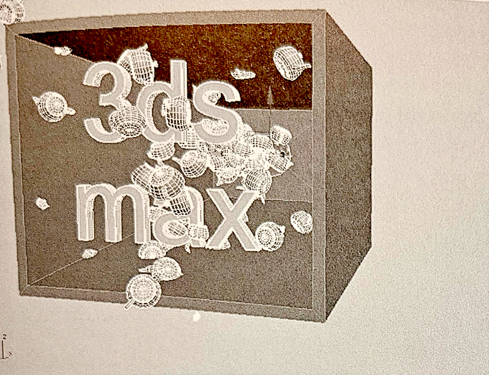
                <figcaption><i><b>Figure-10:</b> With the viewport display set to Mesh, each particle's geopmetry is shown in each viewport.</i></figcaption>
            </figure>
        </td>
        <td style="padding: 5px; margin:0; width:50%;">
            <figure style="text-align: left;">
                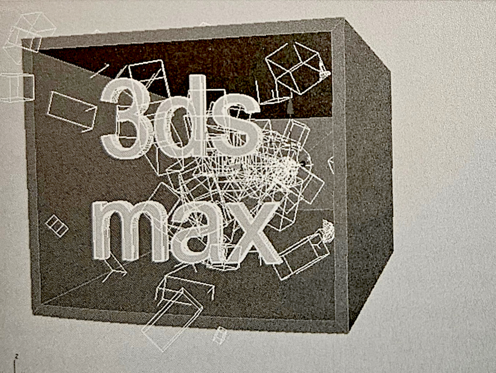
                <figcaption><i><b>Figure-11:</b> With the viewport display set to BBox, only the bounding box for each particle is shown.</i></figcaption>
            </figure>
        </td>
    </tr>
</table>

##### Set the Rendered Particle Size and Type.

Particle size is dependent on the type of particle selected, as well as on the geometry size when instanced geometry or the Tension setting of metaparticles is used. Particles that are too small may not be visible or may not give the impression of volume they should, and particles that are too large may overlap each other in an unwanted manner.

Like many other features found in a Super Spray particle system, Size is teamed up with a Variation parameter that can introduce a random difference in particle size. The Variation value is a percentage greater than or less than the Size value, which represents a range for the particles' allowable dimensions.

###### Using Standard Particles

To experiment with using standard particles, perform the following steps.

1. Continue with the previous exercise or open *SuperSprayType.max* from the companion CD-ROM and then move the Timeline slider to frame *100*.

2. Select the particle system and then open the Modify panel.

3. In the Particle Type rollout, select the Standard Particles in the Particle Types section and then select Sphere as the Standard Particle type *(see Figure-12)*.

<figure style="text-align: left;">
    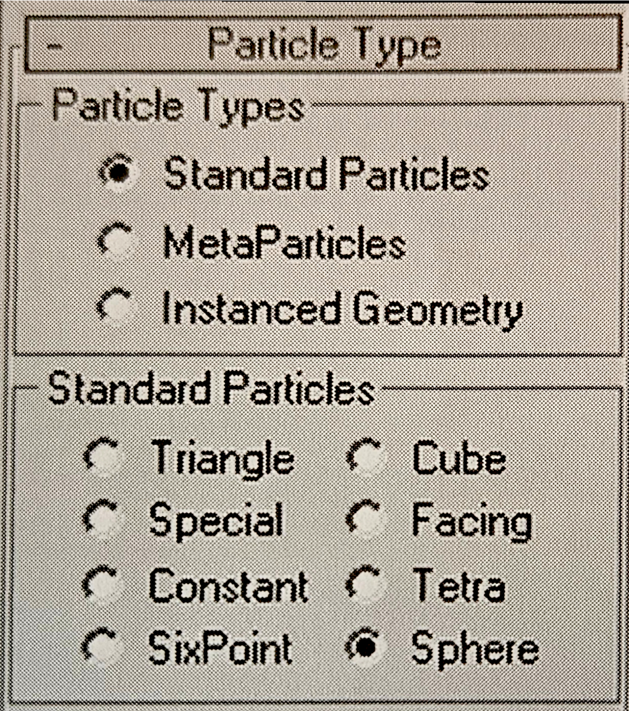
    <figcaption><i><b>Figure-12:</b> Select Standard Particles and Sphere to define the particle shape.</i></figcaption>
</figure>

4. Render the Camera viewport. Where are the particles? They are there, but they are difficult to see because their default Size value of 1.0 is too small for the size of the objects in the scene and the proximity of the camera.

5. In the Particle Generation rollout, set the Size value to about *20* and then render the viewport again.

6. Now the particles are visible and a good size for this exercise *(see Figure-13)*. Verify that the V ariationi value is set to *0.0* and then note that the particles vary in size. This is not caused by the Variation setting but by the Grow For and Fade For settings. Grow For defines the number of frames by which the particles grow, from a size of 0.0 to the value specified by the Size parameter. The Fade For setting defines the number of frames, at the end of theparticles' lives, by which they shrink *(down to zero)*.

<figure style="text-align: left;">
    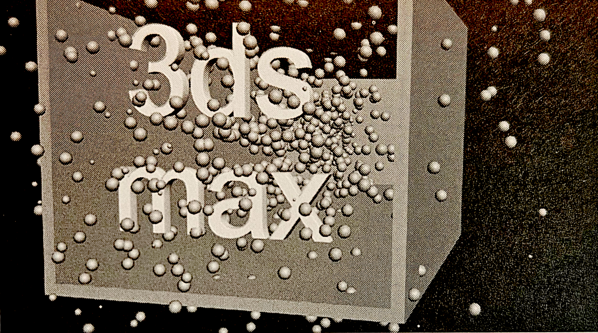
    <figcaption><i><b>Figure-13:</b> With the size set to 20, the particles are now visible.</i></figcaption>
</figure>

7. Set Fade For to *0*, but leave Grow For at *10* so that the spheres will expand in size rather than just appearing at the emitter fully grown.

8. Try experimenting with the other Standard Particle types to see how they look in your scene.

###### Using Metaparticles

As previously mentioned, a metaparticle has a sphere of influence around it that determines *(when it is near another metaparticle from the same particle system)* whether the geometry around it should be drawn toghether to form a blob. Metaparticles are the particle of choice when making fluid animation such as lava lamps, amorphous-shaped attackers, or the occasional zero-gravity alien blood efffect. The Tension setting influences the effect of the metaparticles setting's blending. The greater the tension the more likely the particles are to blend. Continue with the previous exercise by performing the following steps.

1. In the Particle Type rollout, select MetaParticles.

2. Render the viewport.

###### Using Instanced Geometry

The Instanced Geometry particle type allows you to select geometry objects in the scene as substitutes for the particles emitted. Using instanced geometry, your particle system can appear to be emitting anything from text to characters to space ships. Only one object can be selected as the instanced geometry object. However, if the selected object is a group each member of that group will be randomly emitted from the particle system.

Using a group with a significant Variation value can create the appearance of many more objects being emitted than there actually are. When using the instanced geometry particle type, the Size parameter has a different outcome regarding the size of the objects emitted. Rather than an ambiguous value, the Size value becomes a multiplier of the actual size of the object. For example, if a cylinder *(used as instanced geometry)* has a radius of 7 units and the Size parameter is set to 8, the emitted cylinders would have a radius of 56 units. To practice using instanced geometry, perform the following steps.

1. Right-click in an empty area of a viewport to open the quad menu. Click on Unhide All to unhide the apple-shaped object that will soon be emitted by the particle system *(see Figure-14)*.

<figure style="text-align: left;">
    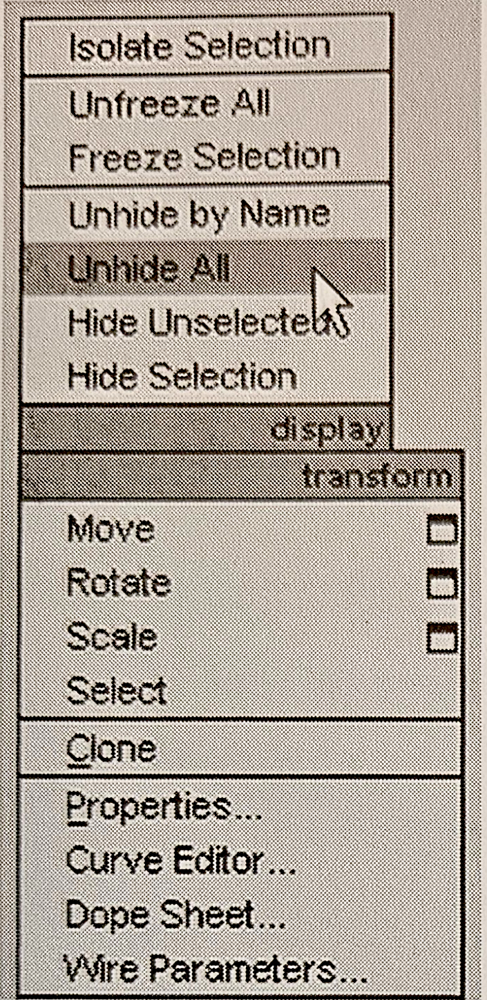
    <figcaption><i><b>Figure-14:</b> Select Unhide All to unhide the geometry that will be emitted.</i></figcaption>
</figure>

2. In the Particle Type rollout, select Instanced Geometry as the particle type.

3. In the Instancing Parameters section, click on the Pick Object button *(see Figure-15)* and then select the apple located behind the box.

<figure style="text-align: left;">
    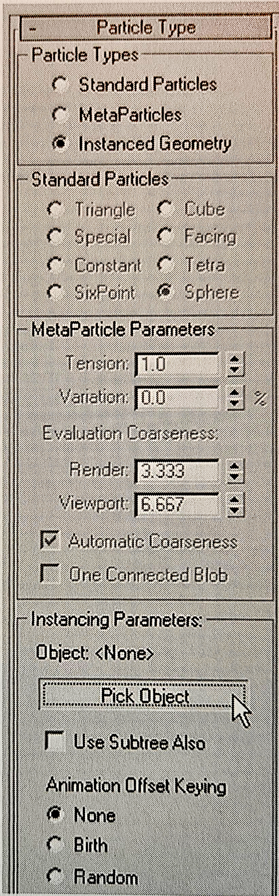
    <figcaption><i><b>Figure-15:</b> Select Instanced Geometry and then click on the Pick Object button.</i></figcaption>
</figure>

4. Render the scene. Your Rendered Frame window shows only a slight change of color in the green spectrum. This is because the size setting is multiplying the size of the apple, already a good size in the scene, to 20 times it's original.

5. In the Particle Generation rollout, set the size to *0.25* and then render the scene again. This produces a flow of apple particles that is much more appealing and manageable *(see Figure-16)*.

<figure style="text-align: left;">
    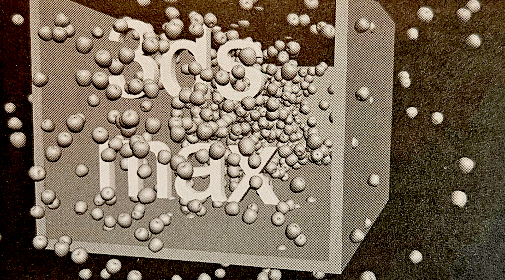
    <figcaption><i><b>Figure-16:</b> Setting the Size value lower than 1.0 reduces the size of the instanced geometry object.</i></figcaption>
</figure>

6. Hide the Apple object. It does not need to be visible to act as the instanced geometry object.

---

#### Alter Particle Direction with Deflectors and Space Warps

Space warps are non-rendering objects in 3ds max that can influence the appearance of geometry or the motion of the particles in a particle system, the latter of which is the focus of this section. Space warps can affect particle systems in several ways, including altering the direction and speed of the particles, introducing randomness to the motion, and causing particles to bounce off objects in the scene. Space warps can improve the appearance of a particle system by altering the *(often linear)* movement of particles and can create the impression of an external force, such as wind, gravity, or an obstruction impeding the flow of particles. The space warps that can affect particle systems in 3ds max include forces and deflector types. Forces iclude the following:

+ ___Motor:___ Creates a rotational force to the particles that approach it, altering their motion to spin around the Motor gizmo in the scene.   

+ ___Vortex:___ Similar to the Motor space warp, Vortex adds a rotational spin to the particle stram. However, the particles are also drawn together and down the length of the vortex gizmo in a swirling pattern similar to water going around a singk and down the drain.   

+ ___Path Follow:___ Causes the particles to follow the contiguous segments of a selected shape in the scene. The particles can follow the path for their entire life, or the path's influence time frame can be determined by parameters set in the space warp's Modify panel.   

+ ___Wind:___ Adds a linear influence to the particles to simulate the effect of wind. Randomness can be added to the wind effect using the Turbulence parameters.   

+ ___Push:___ Used to evenly scatter the partticles in a direction perpendicular to the orientation of the space warp's gizmo.   

+ ___Drag:___ Works in the opposite manner as the Push space warp. Particle motion is slowed and the particles bunch as if they have entered a denser material or an area of greater resistance.   

+ ___PBomb:___ Used to disperse particles as if the particle system has been exploded. Can be used with the PArray particle system to simulate blowing up a mesh object.   

+ ___Gravity:___ Applies a linear or spherical force, similar to Wind, but with fewer controls for turbulence or randomness. 

Deflector types include the following:

+ ___Deflectors:___ Cause particles that impact the deflectors to bounce at the reciprocal angle that they hit the deflector. The Bounce parameter acts as a multiplier regarding the speed of the particles as they exit the deflector relative to their speed when they impact it. Deflectors are planar and SDeflectors are spherical. A UDeflector allows the selection of a scene object to act as a deflector.   

+ ___OmniFlectors:___ Improved versions of the deflectors with additional controls for refracting and spawning particles and the ability to turn the deflection capability on and off. OmniFLectors can be created as planes *(POmniFlect)* or spheres *(SOmniFlect)*, or they can specify a scene object as the deflector *(UOmniFlect)*.   

+ ___DynaFlectors:___ Similar to OmniFlectors, DynaFlectors allow the particles to affect scene geometry. For example, you could use particles to knock objects off a shelf or to spin a target that they impact.

The presence of a space warp in a scene does not immediately cause it to influence all of the particle systems. The particle systems must be associated, or bound, to the space warp using the Bind to Space Warp button in the Main toolbar *(see Figure-17)*. 

<figure style="text-align: left;">
    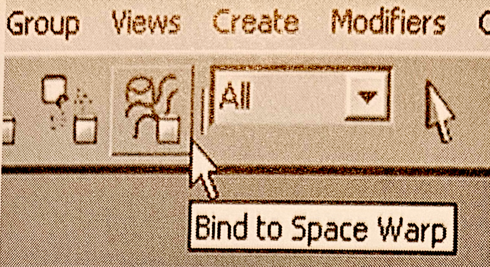
    <figcaption><i><b>Figure-17:</b> Use the Bind to Space Warp button to cause the space warp to influence the particle system.</i></figcaption>
</figure>

Simply click on the button, click on the particle system, and then drag and release over the space warp. The space warp will temporarily turn white to indicate a successful binding process. To verify or delete the binding, select the particle system and then open the Modify panel. All space warp bindings appear in the Stack View window above all modifiers that may be applied. To temporarily discontinue the space warp's effect, simply click on the light bulb icon *(see Figure-18)* to the left of the space warp's binding, and to delete the binding select the binding, right-click, and then select Delete from the context menu that opens. 

<figure style="text-align: left;">
    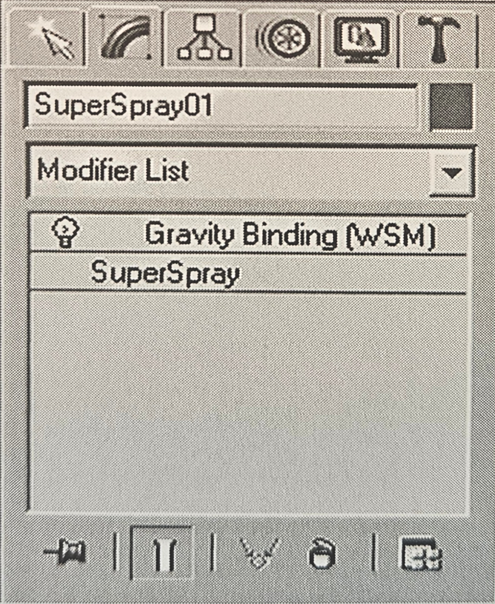
    <figcaption><i><b>Figure-18:</b> The light bulb icon indicates that the space warp binding is currently turned on.</i></figcaption>
</figure>

To modify the parameters for the space warp, you must select the space warp in the viewports rather than selecting the binding in the particle system's Modify panel.

> **NOTE:** Unlike the linking procedure in 3ds max, there is no parent/child relationship  between the particle system and the space warp. The order of the objects selected when you click-drag-release to bind the space warp does not matter.

##### Add Gravity and Wind to a Particle System

To add gravity and wind to a particle system, perform the following steps.

1. Continue with the previous exercise or open *SuperSpraySWarps.max from the companion CD-ROM.

2. Drag the Time slider to frame 1000 so that the effects of the space warps will be apparent.

3. Got to **Create > Space Warps > Forces** in the Command panel and then click on the Gravity button *(see Figure-19)*.

<figure style="text-align: left;">
    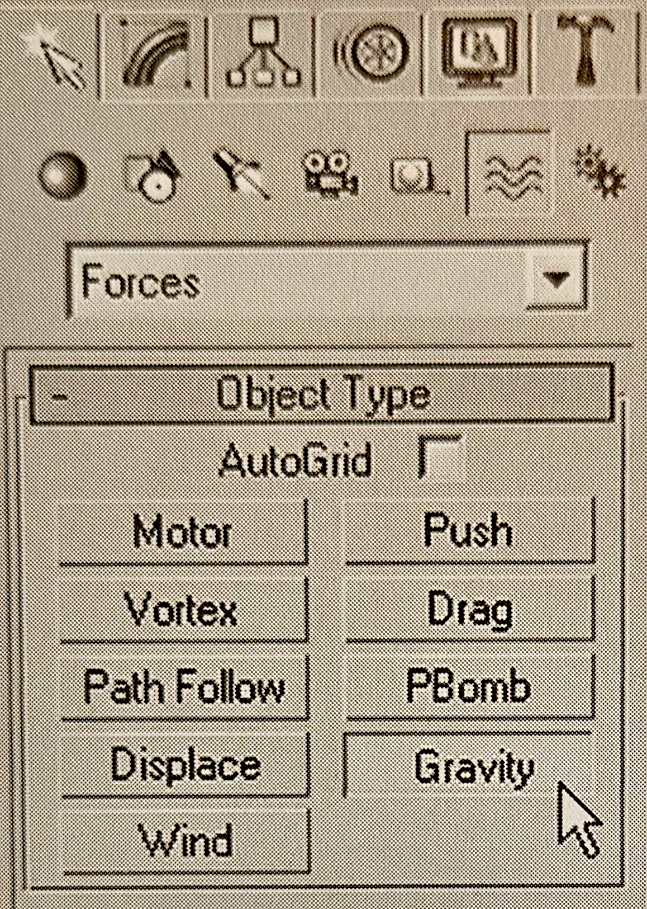
    <figcaption><i><b>Figure-19:</b> Select Gravity in the Create panel.</i></figcaption>
</figure>

4. Click, drag, and then release in the Top viewport to create the Gravity icon. The location and size of the icon does not matter but the orientation does. Creating it in the Top viewport causes the Gravity space warp to be oriented in the World negative Z direction, as indicated by the direction arrow at the base of the icon.

5. Click on the Bind to Space Warp button, click on the particle system, and then drag and release over the Gravity space warp. A dashed rubber-banding line appears between the particle system and the cursor changes to indicate that a binding is taking place. The cursor will hve a white box when it is over a valid bindable object and an X inside when it is not *(see Figure-20)*.

<figure style="text-align: left;">
    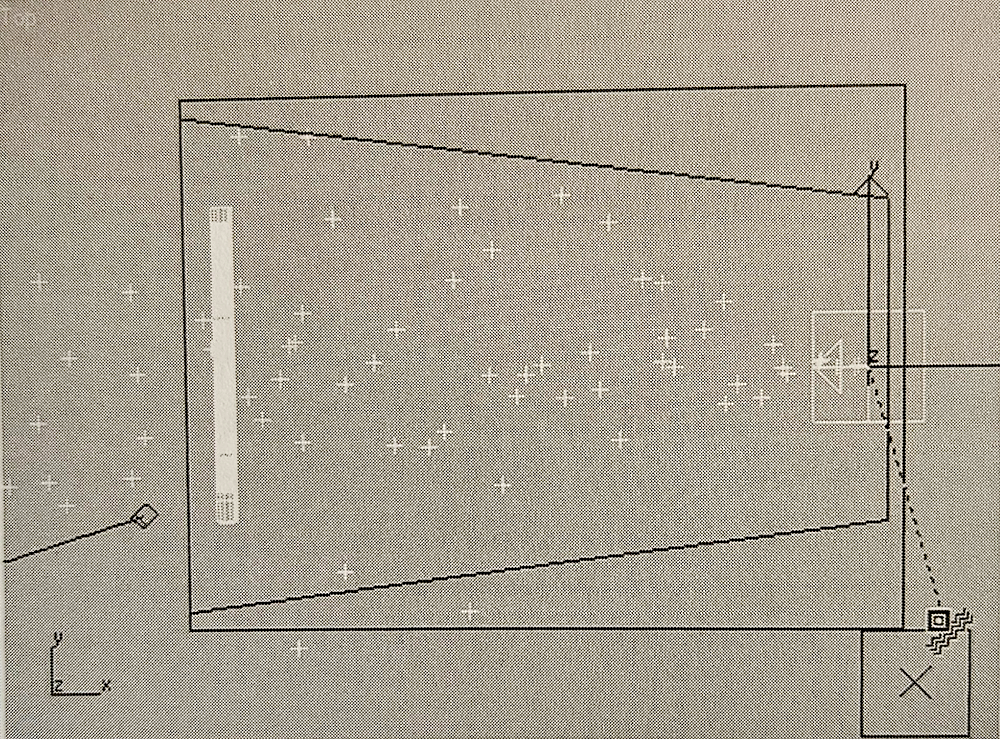
    <figcaption><i><b>Figure-20:</b> A white box appears in the bind cursor when it is over an object type that can be bound to.</i></figcaption>
</figure>

6. The Front viewport best shows the affect of the Gravity space warp on the particles. They drop through the box and off the screen. This will be fixed in the next section using deflectors.

7. Select the Gravity space warp and in the Modify panel set the Strenght value to *0.75* and ensure that the Planar gravity type is selected.

8. Go to **Create > Space Warps** in the Command panel and click on the Wind button. Create a Wind space warp in the Front viewport. This will cause the Wind space warp to push the particles across the box.

9. Rotate the Wind space warp 180 degrees around the Z axis in the Top viewport so that the particles are blown from left to right as they exit the emitter. The space warp can be relocated to a more convenient location, if required, but its actual location does not matter.

10. Bond the Wind space warp to the particle system using the procedure in step 3. The particles are pushed out of the box toward the top of the screen in the Top viewport.

11. Set the Strength to *0.5* and the Turbulence to *4.0* to reduce the influence of the Wind space warp and to introduce randomness to the Wind space warp's effect *(see Figure-21)*.

<figure style="text-align: left;">
    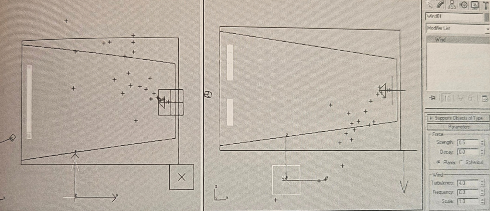
    <figcaption><i><b>Figure-21:</b> After binding and rotating the Wind space warp, adjust the Strength and Turbulence parameters to alter the Wind space warp's effect on the particles.</i></figcaption>
</figure>

##### Add Deflectors to the Particle System

The Gravity and Wind space warps have accomplished their goals of moving the particle stream downward and to the side of the box, but the particles exit the box through the sides and bottom, rather than through the mouth as they should. This will be rectified by creating deflectors to restrict and control the particle motion by forcing the particles to bounce off the walls and the text object.

1. Continue with the previous exercise or open the *SuperSpraySWarps2.max* file from the companion CD-ROM.

2. Drag the Time slider to frame 100 so that the effects of the deflectors on the particles will be apparent.

3. Go to **Create > Space Warps > Deflectors** in the Command panel and the n click on the UOmniFlect button *(see Figure--22)*.

<figure style="text-align: left;">
    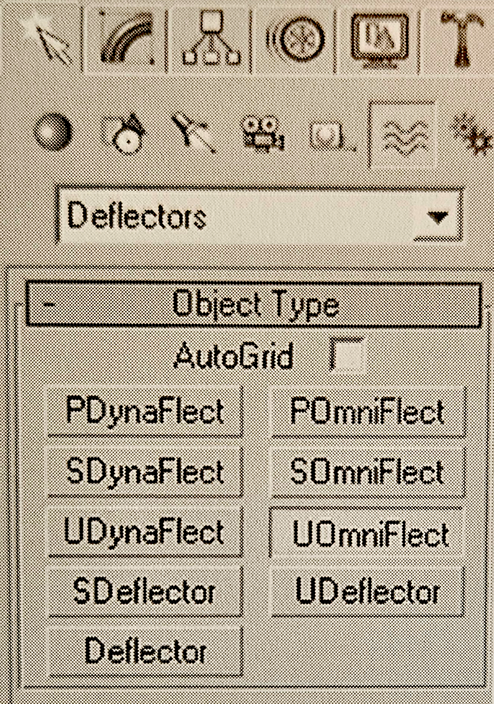
    <figcaption><i><b>Figure-22:</b> Click on the UOmniFlect button to create a deflector that uses a scene object as a deflector.</i></figcaption>
</figure>

4. Click and drag in a viewport to create the deflector icon. Its location and orientation are irrelevant.

5. In the Parameters rollout click on the Pick Object button and then click on the box object. The box will flash white temporarily to indicate the selection is successful, and the name of the object will appear above the Pick Object button.

6. In the Timing section, set the Time On value to *0* and the Time Off value to *200*. This will cause the particles to be deflected for the entire animation length of the scene.

7. Set the Bounce parameter to *0.8* so that the particles will bounce off a wall at only 80% of the velocity they imact it *(see Figure-23)*. Change the Variation setting to *10.0*, allowing the actual bounce speed to vary between 70 and 90% of the impact speed and to establish a small amount of randomness.

<figure style="text-align: left;">
    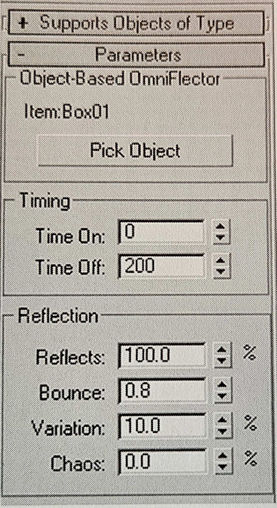
    <figcaption><i><b>Figure-23:</b> Set the UOmniFlect parameters to utilize the box as a deflector and to set the particles' resultant motioni after impacting the deflector.</i></figcaption>
</figure>

 > **NOTE:** Be aware that the Bounce value is cumulative for each time a particle collides with a deflector. For example, if Bounce is set to 0.5 and a particle collides with a deflector, or several deflectors, three times, the final velocity of the particle will be 0.125 (12.5%) of its original.

8. Bind the Deflector to the particle system in the same manner you bound the space warps. The particles are still pushed downward and away by the Gravity and Wind space warps but the box object, acting as a deflector, prevents the particles from escaping *(see Figure-24)*.

<figure style="text-align: left;">
    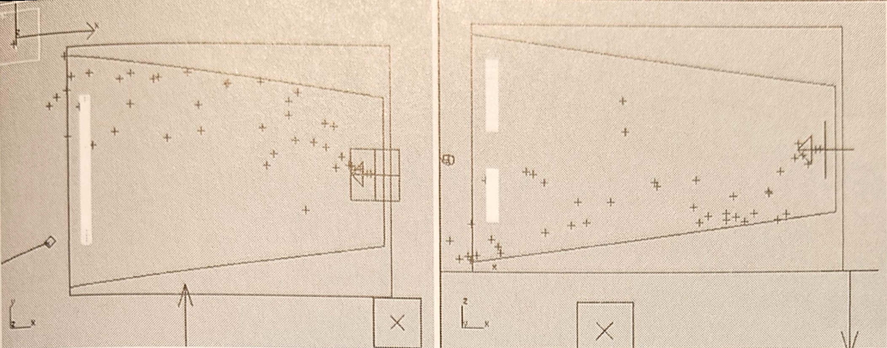
    <figcaption><i><b>Figure-24:</b> After binding the deflector to the particle system, the particles no longer flow through the walls of the box.</i></figcaption>
</figure>

9. Render the Camera viewport *(see Figure-25)*.

<figure style="text-align: left;">
    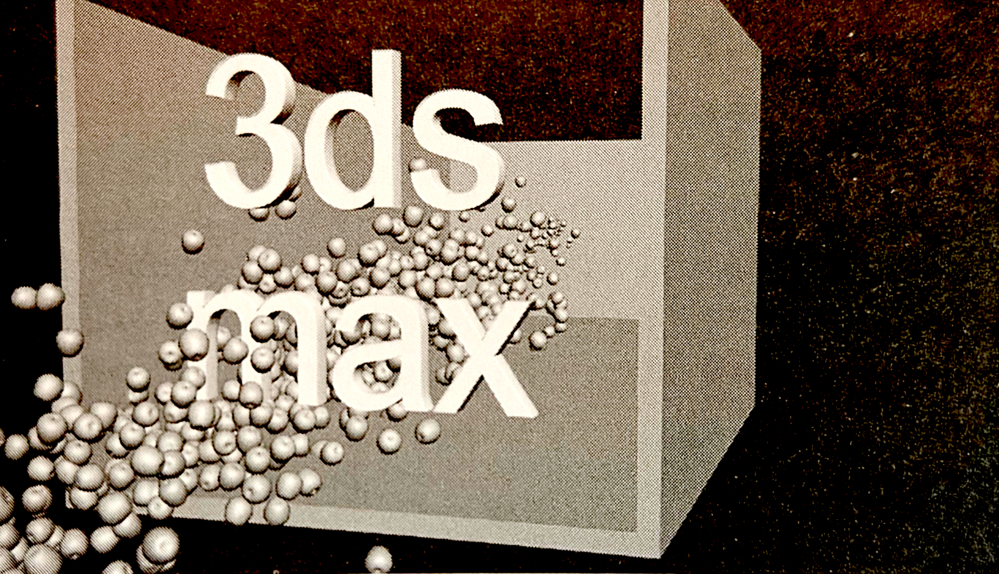
    <figcaption><i><b>Figure-25:</b> The apples now only leave the box throught the mouth.</i></figcaption>
</figure>

10. Hold the Shift key down and move the UOmniFlect deflector to create a clone of it. In the Clone Options dialog box, select the Copy option and then click on OK.

11. Click on the Pick Object buttonh and then click on the text object. This will cause the text object to act as a deflector as well, and will prevent the instanced apples from passing throught the surfaces of the text.

12. When bound space warps are cloned, the binding itself is not. Bind the new UOmniFlect deflector to the particle system.

13. Render the scene one more time and you see that the apples no longer pass through the text.

#### Adjust Particle Spawning to Createt Additional Particles

Spawning is the creation of new particles when a particle collides with a deflector the particle system is bound to. The original particle can die at the point of collision, be unaffected, or die a specified variable amount of time after the colision. The spawned particles can be created at the first collision only, or at a specified number of collisions.

When the collisions occur, any number of particles can be generated from each collision, so caution must be used so that an unwieldy number of new particles are not spawned. For example, a particle system composed of 1,000 particles *(each particle of which spawns ten particles at each of its five collisions with the deflectors)* can create 50,000 particles in the scene in a short amount of time. If these particles are composed of instanced geometry objects, each with only 48 faces, 2,400,000 faces will be quickly added to a scene.

To create additional particles, perform the following steps.

1. Continue with the exercise or open the *SuperSpraySpawn.max* file from the companion CD-ROM.

2. Leave or move the Time slider to frame 0. This will allow you to make changes to the particle system without degrading the system performance while the particle quantity updates.

3. Select the particle system and then open the Modify panel.

4. In the modifier stack, highlight the SuperSpray entry and then scroll down and expand the Particle Spawn rollout *(see Figure-26)*.

<figure style="text-align: left;">
    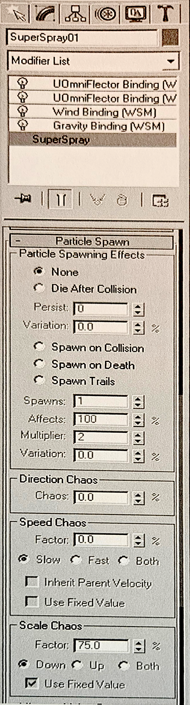
    <figcaption><i><b>Figure-26:</b> After selecting the particle system in the viewports, select the SuperSpray entry in the modifier stack and then expand the Particle Spawn rollout.</i></figcaption>
</figure>

5. In the Particle Spawning Effects section, select the Spawn on Collision option to cause new particles to be spawned.

> **NOTE:** Be careful when using the Spawn Trails option, as this will generate new particles at each frame of the particle's life and can create an immense number of particles.

6. Enter *2* in the Spawns field to create spawned particles for the first two collisions for each particle and leave Affects set to 100% so that all particles involved in collisions are spawned.

7. Set the Multiplier to *2* to create two particles at each collision with a deflector: in this case, the sides of the box.

8. In the Scale Chaos section,  set the Factor parameter to *75*, causing each spawned particle to be 75% the size of the patrticle that spawned it *(see Figure-27)*.

<figure style="text-align: left;">
    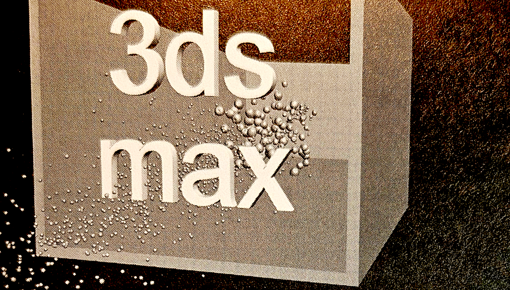
    <figcaption><i><b>Figure-27:</b> After they collide with a deflector, the initial particles die and are replaced with two spawned particles that are 75% the size of the original.</i></figcaption>
</figure>

9. Move the Time slider to frame 100 and then render the Camera viewport.

As you can see, adding a spawn factor to your particle system can give the appearance of your particles breaking into smaller *(or even larger)* versions of themselves after they impact with a deflector. Particle spawning can be used in the creation of 3ds max fireworks by using Spawn Trails to simulate the rocket exhaust as the particle zooms into the air and spawned particles to reproduce the effect of the exploding ordnance. 

---

#### Loading and Saving Particle Presets

When considering the many parameters that can be set in a particle system *(including Particle Quantity, Life, Size, Particle Type, Spawning, and the numberous others)*, setting up several similart particle systems can be tedious. Particle presets can significantly reduce the amount of repetitive settings that must be identified, located, and reproduced by storing the parameter values as a single named value. Once the particle parameters are saved, they can be loaded into any other particle system, overwriting any existing parameters.

The loaded parameters are not locked to the original preset and can be altered to fit the needs of each specific particle system. For example, after the Hose preset is assigned to several particle systems representing fire hoses, each can be modified to give them individuality so that they do not appear to be clones of one another. Particle presets only affect the emission of particles and do not replicate the effects from space warps, which must be separately bound to each particle system they are to affect. The following exercise covers loading and saving a particle preset using a Super Spray particle system to create a magic wand.

##### Load a Particle Preset

To load a particle preset, perform the following steps.

1. Open the *Presets.max* file from the companion CD-ROM. This consists of a magic wand with a star-shaped head linked to the wand's shaft. Any movement of the shaft will result in the head moving as well.

2. In the Top viewport create a Super Spray particle system. The emitter size does not matter. This parameter is controlled by the particle preset that will be loaded.

3. With the Super Spray still selected, click on the Align button in themain toolbar. The Align tool moves and orients one object, called the Current Object, in relation to a selected Target Object *(see Figure-28)*.

<figure style="text-align: left;">
    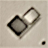
    <figcaption><i><b>Figure-28:</b> The Align tool moves and orients one object in relation to another.</i></figcaption>
</figure>

4. Move the cursor, which now looks like the Align tool's button icon, over the star object and then select it. This opens the Align Selection dialog box, where the parameters for the alignment are specified.

5. The goal is to center the particle system with the star. In the Align Selection dialog box, check the X, Y, and Z Position boxes at the top to instruct 3ds max to move the Current Object and the particle system, in all three axes.

6. Select Center in both the Current Object and Target Object sections. This aligns the center of the particle system's bounding box to the center of the star's bounding box *(see Figure-29)*. In conjunction with the Position boxes selected in step 5, the particle system will be centered on the star. Click on the OK button to complete the alignment.

<figure style="text-align: left;">
    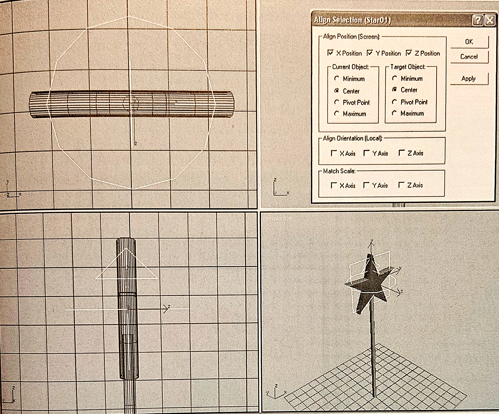
    <figcaption><i><b>Figure-29:</b> Use the Align Selection dialog box to align the center of the particle system to the center of the star.</i></figcaption>
</figure>

7. The particle system must move and change its orientation to match the changes in the star. Click on the Select and Link button in the Main toolbar, click on the particle system, and then drag an drelease over the star. The star will flash white briefly to indicate that the link was successful. The linkage can also be verified by moving or rotating the wand's shaft *(see Figure-30)*.

<figure style="text-align: left;">
    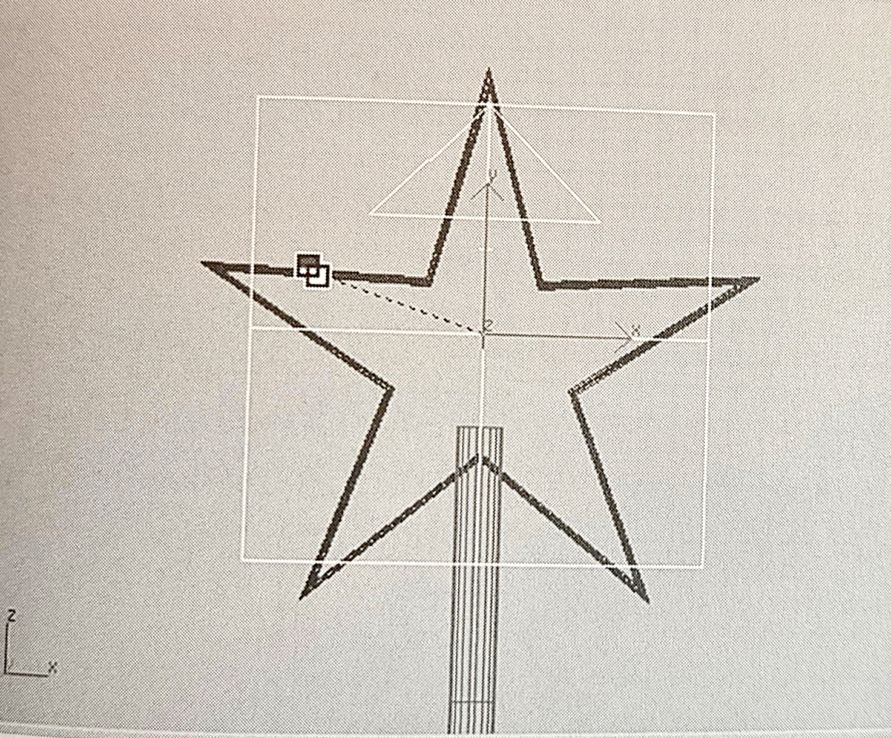
    <figcaption><i><b>Figure-30:</b> Linking the particle system to the star causes any of the star's movements or rotations to be inherited by it.</i></figcaption>
</figure>

8. Click on the Modify tab to display the particle system's rollouts and parameters.

9. Scroll to the bottom of the command panel and then expand the Load/Save Presets rollout. Highlight the Trail preset option in the Saved Presets field and then click on the Load button *(see Figure-31)*.

<figure style="text-align: left;">
    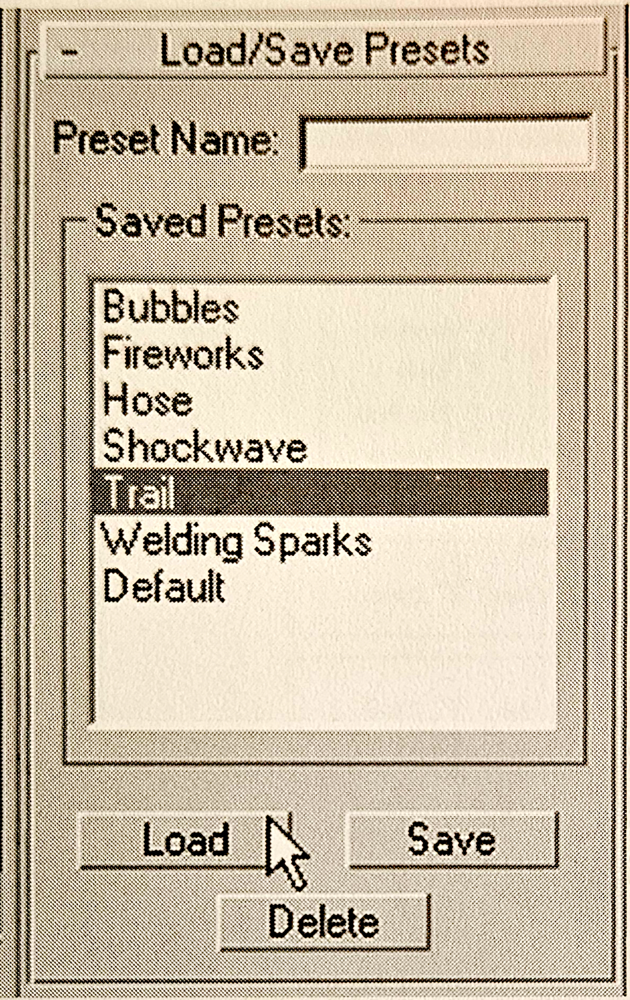
    <figcaption><i><b>Figure-31:</b> With the particle system selected, select the preset to load in the Load/Save Presets rollout.</i></figcaption>
</figure>

10. Move and rotate the magic wand's shaft. The Trail preset emits particles as a trail that follows the particle system wherever it goes *(see Figure-32)*.

<figure style="text-align: left;">
    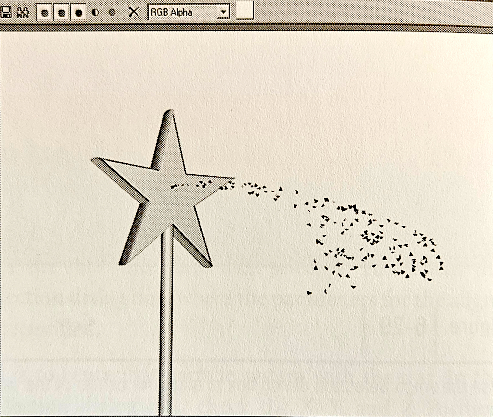
    <figcaption><i><b>Figure-32:</b> The Trail preset emits a trail of particles behind the particle system wherever it moves.</i></figcaption>
</figure>

##### Save a Particle Preset

To save a particle preset, perform the following steps.

1. Continue with the previous exercise or open the *Presets2.max* file from the companion CD-ROM.

2. Select the particle system and then open the Modify panel.

3. In the Particle Genaration rollout, increase the Life value to *25* to create longer trails. The other Particle Timing parameters would need to be changed if the animation length were set to any value greater than 100 frames.

4. Change the Size value to *1.5* and set Grow For to *10* so that the particles grow for the first 10 frames they are alive *(see Figure-33)*.

<figure style="text-align: left;">
    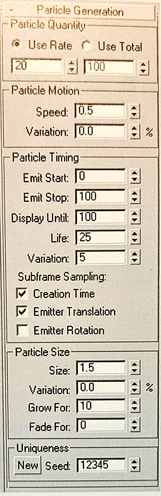
    <figcaption><i><b>Figure-33:</b> Increase the particle Size and Life and add a Grow For factor.</i></figcaption>
</figure>

5. Expand the Particle Type rollout. In the Standard Particles section, select SixPoint to cause the emitter to emit 2D six-pointed star-shaped particles *(see Figure-34)*. Alternatively, you could also select Instanced Geometry *(see Figure-35)* as the particle type and the star as the instanced geometry. However, the Size value must be reduced significantly, to about 0.1.

<table style="border:0; border-spacing:0; border-collapse:collapse;">
    <tr>
        <td style="padding: 5px; margin:0; width:50%;">
            <figure style="text-align: left;">
                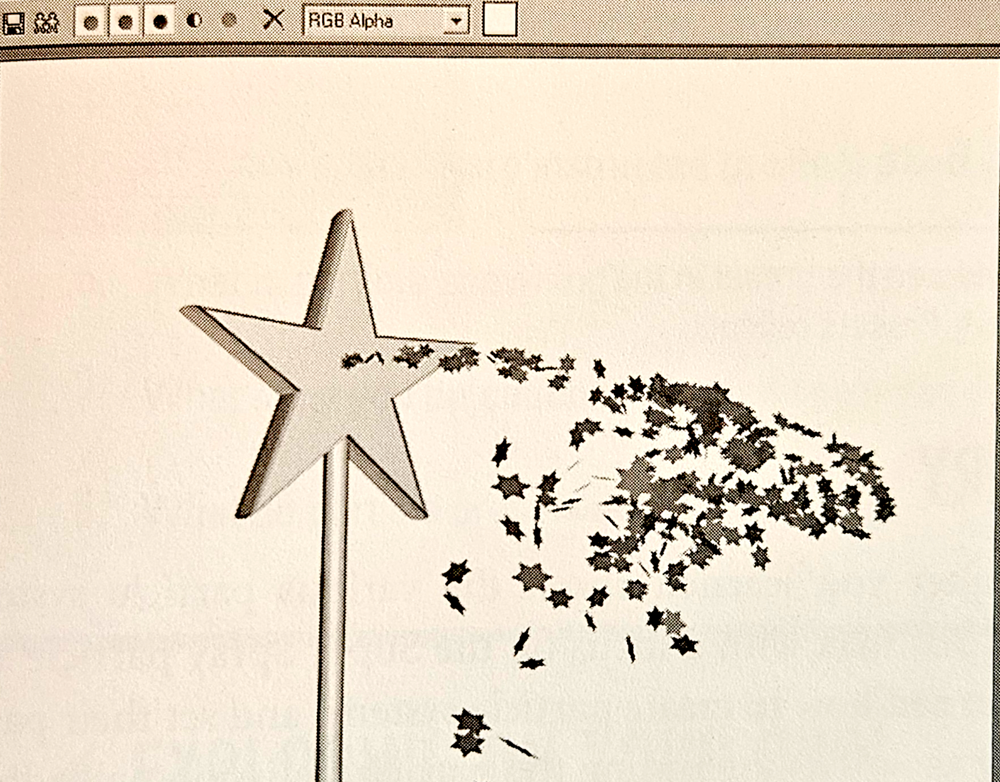
                <figcaption><i><b>Figure-34:</b> Particle system with the particle type set to Standard Particles and SixPoint.</i></figcaption>
            </figure>
        </td>
        <td style="padding: 5px; margin:0; width:50%;">
            <figure style="text-align: left;">
                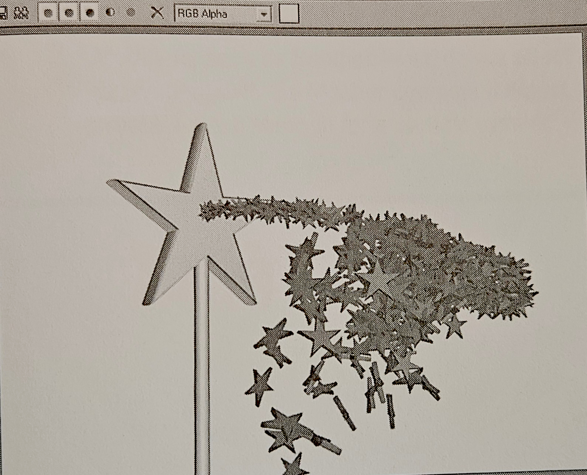
                <figcaption><i><b>Figure-35:</b> Particle system with the particle type set to Instanced Geometry.</i></figcaption>
            </figure>
        </td>
    </tr>
</table>

6. Expand the Load/Save Presets rollout.

7. Enter a name for the new preset, consisting of the currrent particle system's parameters, in the Preset Name field and then click on the Save button. The new preset is created and added to the Saved Presets list *(see Figure-36)*.

<figure style="text-align: left;">
    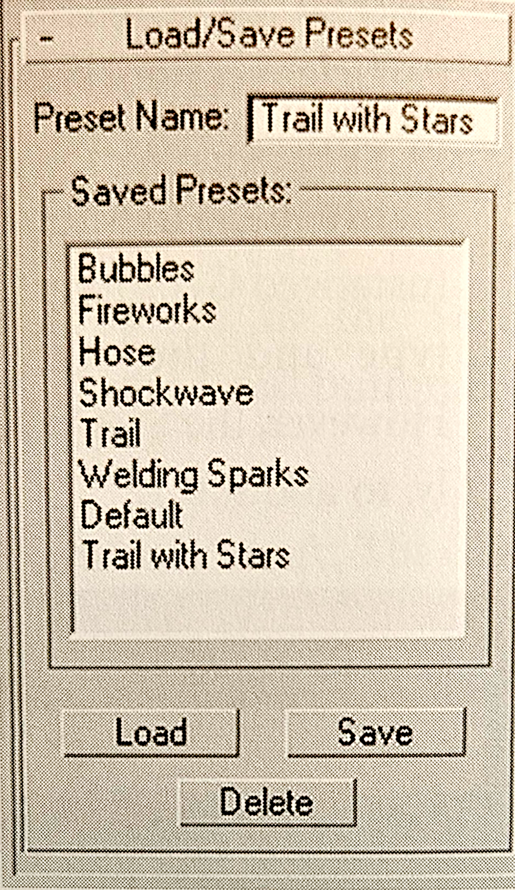
    <figcaption><i><b>Figure-36:</b> Name and add the preset in the Load/Save Presets rollout.</i></figcaption>
</figure>

---

### Summary

In this chapter you learned about the various particle systems available in 3ds max with a focus on the Super Spray particle system. You learned how to create particle systems and set their particle quantity as well as the timing the particle emission will adhere to. The different types of particles available in 3ds max were also covered, including instanced geometry, and the methods for creating new particles once a particle impacts a deflector. Space warps and their effect on particles were addressed, and we covered the loading and saving of particle presets. Particle systems can add a great number of focused or apparently random objects to your scenes that you can control at the system level, without controlling each particle's parameters directly.

#### In Review

1. What is the difference between an event-driven particle system and a non-event-driven particle system?

2. What is the difference between the Life and Display Until parameters?

3. What are the three major types of particle a Super Spray particle system can emit?

4. Name five space warps that can affect a particle system.

5. How is a space warp instructed to affect a particle system?

6. What is particle spawning?

7. What must you be cautious of when spawning particles?

8. What do particle presets do?

 

> ### Exploring On Your Own
> 1. Particles, like any other geometry in 3ds max, can have a material applied to them. Apply a material to your particle system directly, and apply a material to geometry that is instanced by the particle system.
>  
> 2. Rendering effects can be applied to particle systems. Apply a Lense Effects Glow effect to a partilce system so that each particle glows as it is emitted.
>  
> 3. Modifiers, such as Bend or Twist, do not affect the direction of any particles. Experiment with the Mesher compound object, which gives you the ability to create a mesh stand-in for a particle system.